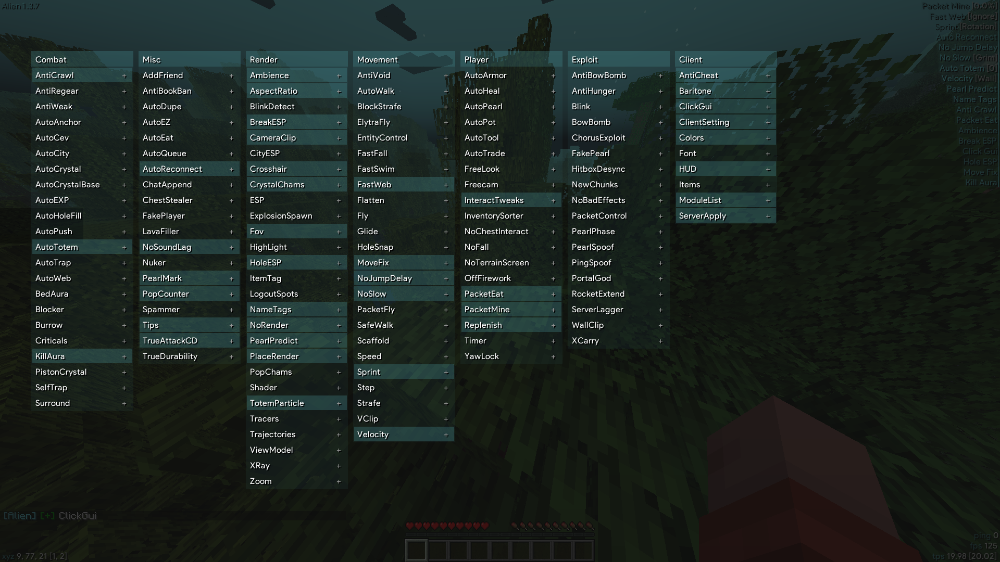

# Gatopera Pro

[English](README.md) | [Español](README_ES.md)

Cliente de Crystal PvP para Minecraft 1.20.4 Fabric.

[](https://github.com/bhirapth/Gatopera-Client/actions/workflows/build.yml)
[](https://www.gnu.org/licenses/gpl-3.0)
[](https://www.minecraft.net/)



## Descargas

**[Última versión](https://github.com/26140070-cpu/Gatopera-Client/releases/latest)**

## Funciones

<details>
<summary><b>Combate</b></summary>

| Módulo | Descripción |
|------|------|
| [AutoCrystal](src/main/java/cc/gatopera/dev/mod/modules/impl/combat/AutoCrystal.java) | Colocación y detonación automática de cristales |
| [AutoCrystalBase](src/main/java/cc/gatopera/dev/mod/modules/impl/combat/AutoCrystalBase.java) | Asistente para colocar la base del cristal |
| [AutoTrap](src/main/java/cc/gatopera/dev/mod/modules/impl/combat/AutoTrap.java) | Encierra a los enemigos en obsidiana |
| [AutoWeb](src/main/java/cc/gatopera/dev/mod/modules/impl/combat/AutoWeb.java) | Trampa de telaraña |
| [AutoLadder](src/main/java/cc/gatopera/dev/mod/modules/impl/combat/AutoLadder.java) | Colocación automática de escaleras |
| [AutoCity](src/main/java/cc/gatopera/dev/mod/modules/impl/combat/AutoCity.java) | Mina la obsidiana de los enemigos |
| [AutoAnchor](src/main/java/cc/gatopera/dev/mod/modules/impl/combat/AutoAnchor.java) | Combate con anclas de reaparición |
| [AutoHoleFill](src/main/java/cc/gatopera/dev/mod/modules/impl/combat/AutoHoleFill.java) | Rellena agujeros automáticamente |
| [PistonCrystal](src/main/java/cc/gatopera/dev/mod/modules/impl/combat/PistonCrystal.java) | Cristal con pistón |
| [BedAura](src/main/java/cc/gatopera/dev/mod/modules/impl/combat/BedAura.java) | Combate con camas |
| [KillAura](src/main/java/cc/gatopera/dev/mod/modules/impl/combat/KillAura.java) | Ataque automático cuerpo a cuerpo |
| [Surround](src/main/java/cc/gatopera/dev/mod/modules/impl/combat/Surround.java) | Rodea al jugador con obsidiana |
| [Burrow](src/main/java/cc/gatopera/dev/mod/modules/impl/combat/Burrow.java) | Se incrusta dentro de un bloque |

</details>

<details>
<summary><b>Jugador</b></summary>

| Módulo | Descripción |
|------|------|
| [AutoGapple](src/main/java/cc/gatopera/dev/mod/modules/impl/player/AutoGapple.java) | Consume manzanas doradas automáticamente |
| [AutoArmor](src/main/java/cc/gatopera/dev/mod/modules/impl/player/AutoArmor.java) | Equipa armadura automáticamente |
| [AutoTool](src/main/java/cc/gatopera/dev/mod/modules/impl/player/AutoTool.java) | Cambia de herramienta automáticamente |
| [AutoMine](src/main/java/cc/gatopera/dev/mod/modules/impl/player/AutoMine.java) | Minería automática |
| [AutoPot](src/main/java/cc/gatopera/dev/mod/modules/impl/player/AutoPot.java) | Uso automático de pociones |
| [AutoHeal](src/main/java/cc/gatopera/dev/mod/modules/impl/player/AutoHeal.java) | Uso automático de botellas de experiencia |
| [AutoTrade](src/main/java/cc/gatopera/dev/mod/modules/impl/player/AutoTrade.java) | Comercio automático con aldeanos |
| [AutoPearl](src/main/java/cc/gatopera/dev/mod/modules/impl/player/AutoPearl.java) | Lanzamiento automático de perlas de Ender |
| [Freecam](src/main/java/cc/gatopera/dev/mod/modules/impl/player/Freecam.java) | Cámara libre |
| [PacketMine](src/main/java/cc/gatopera/dev/mod/modules/impl/player/PacketMine.java) | Minado rápido por paquetes |
| [TimerModule](src/main/java/cc/gatopera/dev/mod/modules/impl/player/TimerModule.java) | Aceleración del tiempo de juego |

</details>

<details>
<summary><b>Movimiento</b></summary>

| Módulo | Descripción |
|------|------|
| [Speed](src/main/java/cc/gatopera/dev/mod/modules/impl/movement/Speed.java) | Aumento de velocidad de movimiento |
| [Fly](src/main/java/cc/gatopera/dev/mod/modules/impl/movement/Fly.java) | Vuelo |
| [Scaffold](src/main/java/cc/gatopera/dev/mod/modules/impl/movement/Scaffold.java) | Construcción automática de puentes |
| [Step](src/main/java/cc/gatopera/dev/mod/modules/impl/movement/Step.java) | Sube bloques automáticamente sin saltar |
| [Velocity](src/main/java/cc/gatopera/dev/mod/modules/impl/movement/Velocity.java) | Reducción o eliminación del empuje (knockback) |
| [Sprint](src/main/java/cc/gatopera/dev/mod/modules/impl/movement/Sprint.java) | Carrera (sprint) automática |
| [HoleSnap](src/main/java/cc/gatopera/dev/mod/modules/impl/movement/HoleSnap.java) | Desplazamiento rápido hacia un agujero seguro |

</details>

<details>
<summary><b>Renderizado</b></summary>

| Módulo | Descripción |
|------|------|
| [ESP](src/main/java/cc/gatopera/dev/mod/modules/impl/render/ESP.java) | Resaltado visual de entidades |
| [HoleESP](src/main/java/cc/gatopera/dev/mod/modules/impl/render/HoleESP.java) | Visualización de agujeros seguros |
| [Tracers](src/main/java/cc/gatopera/dev/mod/modules/impl/render/Tracers.java) | Líneas de rastreo hacia las entidades |
| [NameTags](src/main/java/cc/gatopera/dev/mod/modules/impl/render/NameTags.java) | Etiquetas de nombre mejoradas |
| [CrystalChams](src/main/java/cc/gatopera/dev/mod/modules/impl/render/CrystalChams.java) | Renderizado personalizado/visibilidad de cristales |
| [XRay](src/main/java/cc/gatopera/dev/mod/modules/impl/render/XRay.java) | Visión a través de bloques (X-Ray) |
| [Shader](src/main/java/cc/gatopera/dev/mod/modules/impl/render/Shader.java) | Efectos visuales de posprocesamiento |

</details>

<details>
<summary><b>Exploits</b></summary>

| Módulo | Descripción |
|------|------|
| [Blink](src/main/java/cc/gatopera/dev/mod/modules/impl/exploit/Blink.java) | Congelación del envío de paquetes |
| [PearlPhase](src/main/java/cc/gatopera/dev/mod/modules/impl/exploit/PearlPhase.java) | Atraviesa paredes mediante perlas de Ender |
| [WallClip](src/main/java/cc/gatopera/dev/mod/modules/impl/exploit/WallClip.java) | Atravesar paredes |
| [XCarry](src/main/java/cc/gatopera/dev/mod/modules/impl/exploit/XCarry.java) | Retiene objetos en la cuadrícula de fabricación del inventario |

</details>

## Requisitos del sistema

- Minecraft 1.20.4
- Fabric Loader 0.15.7+
- Java 17+

## Compilación

```bash
git clone https://github.com/26140070-cpu/Gatopera-Client.git
cd Gatopera-Client
./gradlew build
```

El archivo generado se encontrará en `build/libs/`.

## Licencia

[GNU General Public License v3](LICENSE)